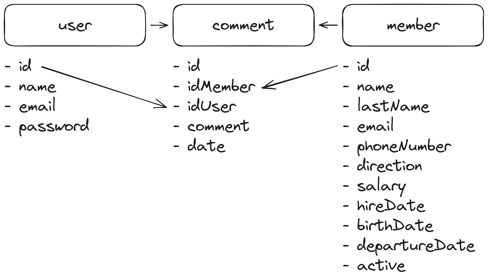

# AD-3 - API REST

Para este proyecto se va a hacer una herramienta para un equipo de recursos humanos que les permita llevar un control de los empleados, sus datos personales, sus salarios, sus vacaciones, sus bajas, sus permisos, etc. a traves de comentarios, son 3 tablas las que se van a utilizar,

user - Que es la persona de recursos humanos que va a utilizar la herramienta
member - Que es el empleado de la empresa
comment - Que es el comentario que se va a hacer sobre el empleado, puede consistir en una baja, un permiso, una vacación, un comentario sobre el salario, etc.

## Base de datos



```sql
CREATE DATABASE IF NOT EXISTS `ad_3`;

USE `ad_3`;

CREATE TABLE IF NOT EXISTS `user` (
    `id` INT(11) NOT NULL AUTO_INCREMENT,
    `name` VARCHAR(255) NOT NULL,
		`lastName` VARCHAR(255) NOT NULL,
    `email` VARCHAR(255) NOT NULL,
    `password` VARCHAR(255) NOT NULL,
    PRIMARY KEY (`id`)
);

CREATE TABLE IF NOT EXISTS `member` (
    `id` INT(11) NOT NULL AUTO_INCREMENT,
    `name` VARCHAR(255) NOT NULL,
    `lastName` VARCHAR(255) NOT NULL,
    `email` VARCHAR(255) NOT NULL,
    `phoneNumber` VARCHAR(255) NOT NULL,
    `address` VARCHAR(255) NOT NULL,
    `salary` DECIMAL(10,2) NOT NULL,
    `birthDate` DATE NOT NULL,
    `hireDate` DATE NOT NULL,
		`role` VARCHAR(255) NOT NULL,
	  `departureDate` DATE,
    `active` TINYINT(1) NOT NULL,

    PRIMARY KEY (`id`)
);

CREATE TABLE IF NOT EXISTS `comment` (
    `id` INT(11) NOT NULL AUTO_INCREMENT,
    `idMember` INT(11) NOT NULL,
    `idUser` INT(11) NOT NULL,
    `comment` TEXT NOT NULL,
		`type` VARCHAR(255) NOT NULL,
    `date` DATE NOT NULL,
		`endDate` DATE,
    PRIMARY KEY (`id`)
);

```

### Endpoints

#### Usuarios

- **GET /api/usuarios/:id**
  - Obtener un usuario específico
  - **Parámetros:**
    - :id (integer) - Identificador del usuario
  - **Respuesta:**
    - Devuelve un objeto con los datos del usuario.
    ```json
    {
      "id": 1,
      "name": "Juan",
      "lastName": "Perez",
      "email": "juaper@email.com"
    }
    ```

- **POST /api/usuarios**
  - Crear un nuevo usuario
  - **Datos de entrada:**
    - Objeto con los datos del usuario
    ```json
    {
      "name": "Juan",
      "lastName": "Perez",
      "email": "juaper@email.com",
      "password": "1234"
    }
    ```
  - **Respuesta:**
    - Devuelve un objeto con los datos del usuario recién creado.
    ```json
    {
      "id": 1,
      "name": "Juan",
      "lastName": "Perez",
      "email": "juaper@email.com"
    }
    ```

- **DELETE /api/usuarios/:id**
  - Eliminar un usuario
  - **Parámetros:**
    - :id (integer) - Identificador del usuario
  - **Respuesta:**
    - Devuelve un booleano indicando si se ha borrado o no.
    ```json
    {
      "deleted": true
    }
    ```

#### Miembros

- **GET /api/miembros**
  - Obtener todos los miembros
  - **Respuesta:**
    - Devuelve un array con todos los miembros.
    ```json
    [
      {
        "id": 1,
        "name": "Miembro1",
        "lastName": "Apellido1",
        "email": "miembro1@email.com",
        "phoneNumber": "123456789",
        "address": "Dirección1",
        "salary": 50000.00,
        "birthDate": "1990-01-01",
        "hireDate": "2020-01-01",
        "role": "Puesto1",
        "departureDate": null,
        "active": 1
      },
      // Otros miembros...
    ]
    ```

- **GET /api/miembros/:id**
  - Obtener un miembro específico
  - **Parámetros:**
    - :id (integer) - Identificador del miembro
  - **Respuesta:**
    - Devuelve un objeto con los datos del miembro.
    ```json
    {
      "id": 1,
      "name": "Miembro1",
      "lastName": "Apellido1",
      "email": "miembro1@email.com",
      "phoneNumber": "123456789",
      "address": "Dirección1",
      "salary": 50000.00,
      "birthDate": "1990-01-01",
      "hireDate": "2020-01-01",
      "role": "Puesto1",
      "departureDate": null,
      "active": 1
    }
    ```

- **POST /api/miembros**
  - Crear un nuevo miembro
  - **Datos de entrada:**
    - Objeto con los datos del miembro
    ```json
    {
      "name": "NuevoMiembro",
      "lastName": "NuevoApellido",
      "email": "nuevomiembro@email.com",
      "phoneNumber": "987654321",
      "address": "NuevaDirección",
      "salary": 60000.00,
      "birthDate": "1995-02-15",
      "hireDate": "2022-03-01",
      "role": "NuevoPuesto",
      "departureDate": null,
      "active": 1
    }
    ```
  - **Respuesta:**
    - Devuelve un objeto con los datos del miembro recién creado.
    ```json
    {
      "id": 2,
      "name": "NuevoMiembro",
      "lastName": "NuevoApellido",
      "email": "nuevomiembro@email.com",
      "phoneNumber": "987654321",
      "address": "NuevaDirección",
      "salary": 60000.00,
      "birthDate": "1995-02-15",
      "hireDate": "2022-03-01",
      "role": "NuevoPuesto",
      "departureDate": null,
      "active": 1
    }
    ```

- **PUT /api/miembros/:id**
  - Modificar un miembro existente
  - Esto también hara una llamada a la api de comentarios para añadir comentarios de la modificaciones realizadas
  - **Parámetros:**
    - :id (integer) - Identificador del miembro
  - **Datos de entrada:**
    - Objeto con los nuevos datos del miembro
    ```json
    {
      "name": "MiembroModificado",
      "lastName": "ApellidoModificado",
      "email": "modificado@email.com",
      "phoneNumber": "111111111",
      "address": "NuevaDirecciónModificada",
      "salary": 70000.00,
      "birthDate": "1993-05-20",
      "role": "PuestoModificado"
    }
    ```
  - **Respuesta:**
    - Devuelve un objeto con los datos actualizados del miembro.
    ```json
    {
      "id": 1,
      "name": "MiembroModificado",
      "lastName": "ApellidoModificado",
      "email": "modificado@email.com",
      "phoneNumber": "111111111",
      "address": "NuevaDirecciónModificada",
      "salary": 70000.00,
      "birthDate": "1993-05-20",
      "role": "PuestoModificado",
      "departureDate": null,
      "active": 1
    }
    ```

- **DELETE /api/miembros/:id**
  - Eliminar un miembro
  - **Parámetros:**
    - :id (integer) - Identificador del miembro
  - **Respuesta:**
    - Devuelve un booleano indicando si se ha borrado o no.
    ```json
    {
      "deleted": true
    }
    ```

#### Comentarios

- **GET /api/comentarios/:idMiembro**
  - Obtener todos los comentarios de un miembro
  - **Parámetros:**
    - :idMiembro (integer) - Identificador del miembro
  - **Respuesta:**
    - Devuelve un array con todos los comentarios de un miembro.
    ```json
    [
      {
        "id": 1,
        "idMember": 1,
        "idUser": 1,
        "type": "Alta",
        "comment": "Comentario sobre el miembro",
        "date": "2022-03-10",
        "endDate": null
      },
      {
        "id": 2,
        "idMember": 1,
        "idUser": 1,
        "type": "Aumento de salario",
        "comment": "Comentario sobre el miembro",
        "date": "2022-03-10",
        "endDate": null
      },
      {
        "id": 3,
        "idMember": 1,
        "idUser": 1,
        "type": "Baja",
        "comment": "Comentario sobre el miembro",
        "date": "2022-03-10",
        "endDate": "2022-03-11"
      }
    ]
    ```

- **GET /api/comentarios/:idMiembro/:id**
  - Obtener un comentario específico de un miembro
  - **Parámetros:**
    - :idMiembro (integer) - Identificador del miembro
    - :id (integer) - Identificador del comentario
  - **Respuesta:**
    - Devuelve un objeto con los datos del comentario.
    ```json
    {
      "id": 1,
      "idMember": 1,
      "idUser": 1,
      "type": "Alta",
      "comment": "Comentario sobre el miembro",
      "date": "2022-03-10",
      "endDate": null
    }
    ```

- **POST /api/comentarios**
  - Crear un nuevo comentario
  - **Datos de entrada:**
    - Objeto con los datos del comentario
    ```json
    {
      "idMember": 1,
      "idUser": 1,
      "type": "Comentario",
      "comment": "Nuevo comentario sobre el miembro",
      "date": "2022-03-11"
    }
    ```
  - **Respuesta:**
    - Devuelve un objeto con los datos del comentario recién creado.
    ```json
    {
      "id": 4,
      "idMember": 1,
      "idUser": 1,
      "type": "Comentario",
      "comment": "Nuevo comentario sobre el miembro",
      "date": "2022-03-11"
    }
    ```

- **DELETE /api/comentarios/:id**
  - Eliminar un comentario
  - **Parámetros:**
    - :id (integer) - Identificador del comentario
  - **Respuesta:**
    - Devuelve un booleano indicando si se ha borrado o no.
    ```json
    {
      "deleted": true
    }
    ```